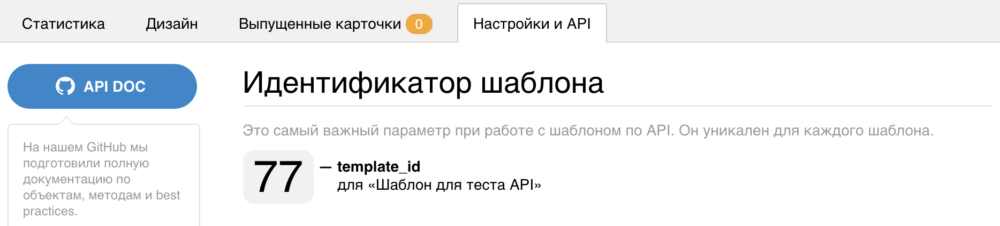
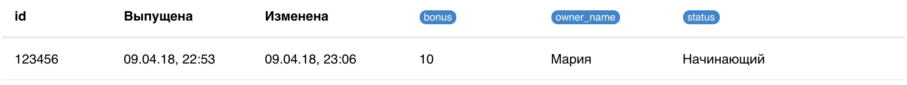
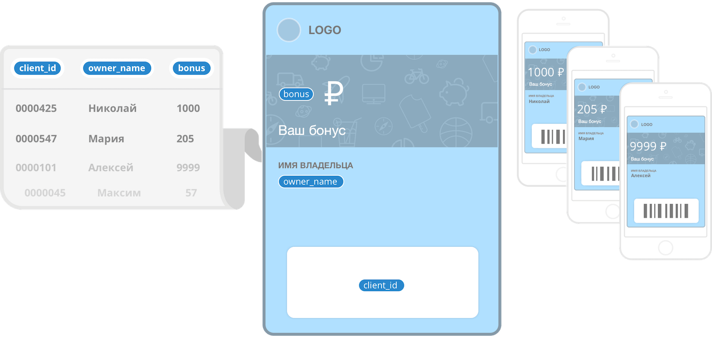

# card2b — API documentation

Card2b предоставляет сервис для генерации pkpass карточек. Простой интерфейс позволет создателям карт сосредоточиться на качественном взаимодействии с клиентами, а не на сложностях реализации.

Наша цель — популяризация электронных карт для всех: от купонов online-магазинов до билетов в международных авиакомпаниях.

А ещё:
1. Мы очень любим делать полезные сервисы;
2. Нам надоело заполнять бумажные анкеты и носить пластиковые карты в своих карманах.


hello@card2b.com - по вопросам сотрудничества, пожеланиям и предложениям


P.S.: будем рады разместить здесь Ваши примеры реализации, ссылки на плагины и библиотеки работы с сервисом.

# Cтраницы документации
[Работа с API: объекты, коды ошибок](./doc/working-with-api.md)

[Карточки и методы работы с ними](./doc/cards.md)

[Шаблоны карточек](./doc/templates.md)

[Базовые концепции](./doc/base-concepts.md)

[FAQ по сертификатам](./certs/certs-faq.md)

[Как создать сертификат: подробная инструкция](./certs/cert-creation.md)


# card2b — быстрый старт по API
Работа по API https://card2b.com возможна только после регистрации и подтверждения e-mail.
Ниже представлен пример типичного рабочего процесса.


## 0. Узнаем свой API-токен
Это легко. Ваш токен можно посмотреть в профиле пользователя в [личном кабинете](https://card2b.com/cabinet)


## 1. Создаём и настраиваем шаблон
Шаблон - основа для выпускаемых карточек. Он позволяет задать внешний вид карточек (тип разметки, поля и их содержание, изображения),
определить структуру данных, значения по умолчанию, а так же технические настройки — всё это наследуются выпускаемыми картами.

**Внимание!** Вы можете создать и использовать собственный шаблон или сгенерировать тестовый шаблон из текущего примера, он доступен по специальной ссылке:
https://card2b.com/cabinet/templates/new?example=apidoc

Как Вы можете заметить, в дизайне шаблона можно задавать переменные параметры, они отрисовываются синим плейсхолдером.
При выпуске карточек Вы можете переопредять значения этих переменных.


## 2. Сохраняем шаблон и узнаем template_id

После сохранения шаблона появляются несколько влкадок. Идём на вкладку "Настройка и API", где указан **template_id** текущего шаблона и небольшая шпаргалка по работе с API.




## 3. Выпускаем карточку по API
Представим, что мы хотим выпустить карту из нашего шаблона. Если Вы сгенерировали шаблон по ссылке, то могли заметить переменную **owner_name**.
По задумке в это поле будет помещаться имя владельца карточки. Выпустим карточку для Маши:


[Отправляем POST](./doc/cards.md#api_card_issue). Подставьте **TOKEN** и **TEMPLATE_ID**:

```bash
curl -H "Content-Type: application/json" \
    "https://card2b.com/api/card/issue?api_token=TOKEN" \
    -d '{"template_id":TEMPLATE_ID, "override_data": {"owner_name":"Маша"}}'
```

**Внимание!**: среди прочего в запросе передаётся блок **override_data**, который переопредет значения параметров относительно шаблона в формате **key: value**

Ответ будет примерно такой:

```json
{"card_id": 123456, "url": "https://card2b.com/c/123456/4e370ec1d209d188"}
```

Карта выпущена! Теперь её можно увидеть в личном кабинете на вкладке "Выпущенные карты":



В ответе так же вернулся url - это тот самый адрес, который можно передать клиенту (способ зависит от Ваших предпочтений: email, sms, qr код).
Представим себя на месте Маши и откроем эту ссылку со своего телефона.


## 4. Получаем карточку по API

[Делаем GET запрос на получение карточки](./doc/cards.md#api_card_get). Подставьте **TOKEN** и **CARD_ID**:

```bash
curl "https://{domain}/api/card/CARD_ID?api_token=TOKEN
```

Ответ будет [содержать карточку](./doc/working-with-api.md#card):

```json
{
  "card_id": 123456,
  "url": "https://{domain}/c/123456/b5671f6713375e9b",
  "data": {
    "bonus": 0,
    "status": "Начинающий",
    "owner_name": "Мария"
  },
  "create_time": "2018-04-09T19:53:08.000Z",
  "update_time": "2018-04-09T19:53:08.000Z",
  "last_request_time": "2018-04-09T19:54:12.000Z",
  "n_installed": 1,
  "deactivated": false,
  "versions": [
    {"v_num": 1, "valid_from": "2018-04-09T19:53:08.000Z"}
  ]
}
```


## 5. Изменяем карточку по API
Допустим, что Маше начислены 10 бонусов и мы хотим отобразить это на её карте.
Сделаем [POST запрос на изменение карточки](./doc/cards.md#api_card_update). Подставьте **TOKEN** и **CARD_ID**:

```bash
curl -H "Content-Type: application/json" \
    "https://{domain}/api/card/CARD_ID/update?api_token=TOKEN" \
    -d '{"override_data": {"bonus":10}}'
```

В ответе будет

```json
{"card_id": 123456, "changed": true}
```

В течение нескольких секунд **на Вашем телефоне карточка должна обновиться**, а также будет уведомление, что новый бонус теперь 10₽
(оно показалось, т.к. установлено "уведомление при изменении" в дизайне шаблона).

Теперь карточка содержит новое значение **bonus**. Кроме того, можно отслеживать историю и статистику изменений.

## 6. Отправляем уведомление на карточку
Если мы хотим уведомить Машу о персональном предложении, можно отправить ей Push-уведомление.
[Делаем POST запрос на отправку уведомления на конкретную карточку](./doc/cards.md#api_card_notify). Подставьте **TOKEN** и **CARD_ID**:

```bash
curl -H "Content-Type: application/json" \
    "https://{domain}/api/card/CARD_ID/notify?api_token=TOKEN" \
    -d '{"notify_text": "Привет! Так можно делать вместо SMS-ок"}'
```


На заблокированном экране телефона Маши отобразится уведомление. На сайте это делается здесь:


## 7. Что дальше?

Получить все карточки шаблона можно через [/api/template/:id/cards](./templates.md#api_template_cards).

Карточки версионируются при изменении данных. Старые версии доступны [по api](./doc/cards.md#api_card_get_vnum) и в UI.

Шаблоны тоже версионируются. Более того: изменение настроек/данных шаблона приводит к новым версиям всех выпущенных карточек.

Можно получать статистику. Например, сумму бонусов всех клиентов по времени.

Обо всём этом чуть подробнее написано в [концепции](./doc/basic-concepts.md).

[Здесь](./working-with-api.md) — про работу с API и обработку ошибок.
И полная документация: [по API карточек](./cards.md) и [по API шаблонов](./templates.md).


