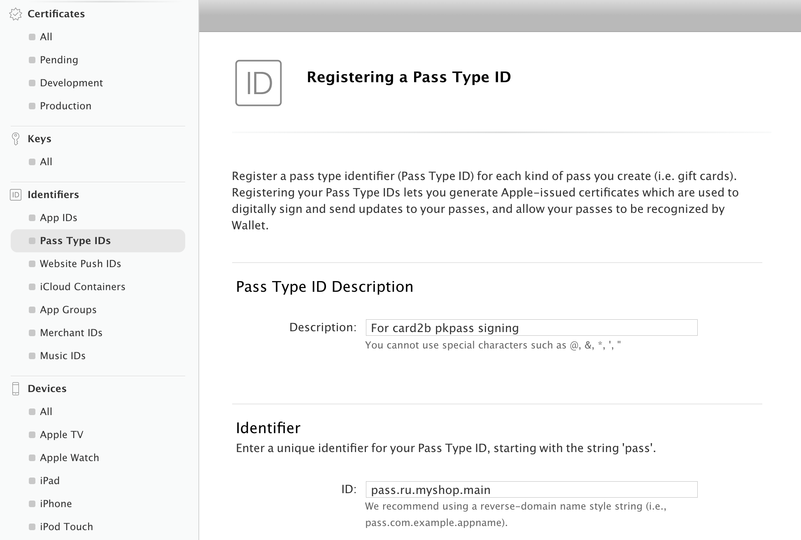
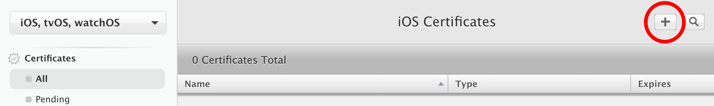
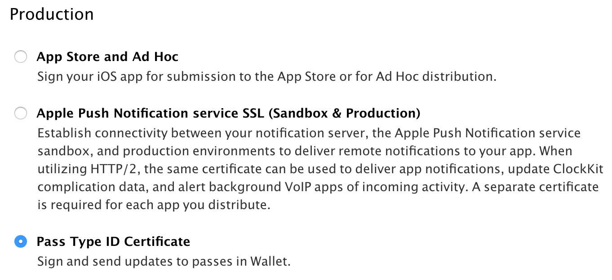
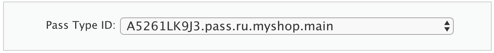
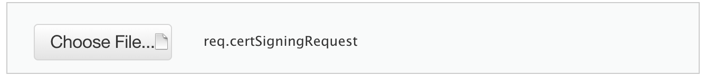
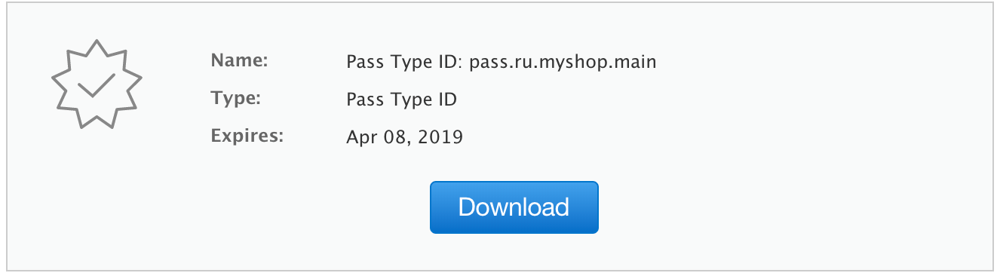
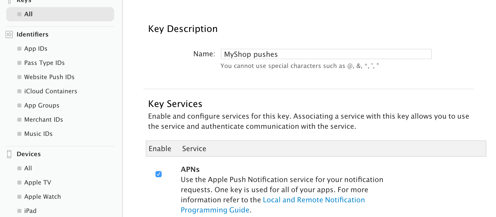
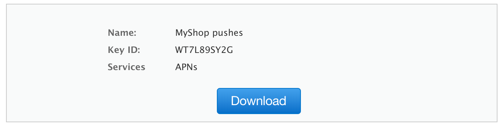

# Создание собственного Apple-сертификата

Чтобы начать создавать собственный сертификат, нужно сначала создать аккаунт на https://developer.apple.com/.

Далее подробно рассмотрим все необходимые шаги, чтобы выпустить сертификат для подписывания pkpass и ключ для рассылки пушей.


## 1. Создание pass_type_id

Выберите слева пункт "Identifiers" → "Pass Type IDs". Нажмите "+" сверху. 

В поле "Description" введите что угодно. Например, "For card2b pkpass signing". 
 
В поле "ID" — уникальный id сертификата. 
Обычно он вводится так. Если домен вашего сайта *main.myshop.ru*, то pass_type_id — "'pass.' + reverse-domain string", т.е. *pass.ru.myshop.main*.

    

Нажмите "Continue" ниже, а затем "Register" и "Done".  


## 2. Самое сложное. Создание сертификата

**Цель**: получить на выходе .pem-файл. С помощью него будут подписываться карточки для Ваших клиентов (pkpass-файлы для Apple Wallet).

> Предполагается, что Вы с консолью "на ты", и Вам не составит труда исполнить несколько нижеприведённых команд. Они подходят для Mac, Linux, а также Windows при наличии Cygwin или аналогов. 

Создаём пустую папку (пусть *mycert*) и заходим в неё:

```
mkdir mycert
cd mycert
```

Создаём .key-файл: 

```
openssl genrsa -out keyname.key 2048
```

Создаём из него .certSigningRequest-файл. 
В этой строчке вместо "contact@myshop.ru" введите e-mail Вашей огранизации, а вместо "MyShop Store" название компании по-английски.

```
openssl req -new -key keyname.key -out req.certSigningRequest -subj "/emailAddress=contact@myshop.ru, CN=MyShop Store, C=RU"
```

Вот этот *req.certSigningRequest* нужно будет загрузить в Apple-аккаунт, чтобы продолжить.

Сначала слева "Certificates" → "All" и плюсик:



Там нужно отметить "Pass Type ID Certificate", затем "Continue" ниже.



Там выбрать из списка Pass Type ID и "Continue" ниже.



Потом ещё раз "Continue" ниже, на текст сверху не обращаем внимания.

Пришло время загрузить req.certSigningRequest, который мы сделали ранее.



И, наконец, нажимаем "Download", чтобы скачать файл pass.cer.



**Итак, Вы скачали файл pass.cer с Apple**. Поместите его в ту же папку *mycert*.

Итого, там сейчас 3 файла: *keyname.key*, *req.certSigningRequest* и *pass.cer*.

Делаем из этого .cer-файла первый .pem-файл:

```
openssl x509 -in pass.cer -inform DER -out pass.pem -outform PEM
```

Потом из .key-файла и этого .pem-файла делаем .p12-файл:

```
openssl pkcs12 -export -inkey keyname.key -in pass.pem -out pass.p12
```

(вас спросят "Enter Export password", там проще оставить пустым, т.е. просто нажать Enter)

И, наконец, из этого .p12 делаем последнее:

```
openssl pkcs12 -in pass.p12 -out pass.pem -nodes
```

(вводим тот же пароль, или просто Enter, если было без пароля)

**Всё!** Этот файл **pass.pem** и есть сертификат подлинности, который нужно загрузить в аккаунт на card2b. 

> Небольшая справка. pass_type_id будет зашит внутрь этого .pem-ника, т.к. *pass.cer* был сгенерирован из того же Apple-аккаунта.


## 3. p8-файл, чтобы слать пуши

> Этот шаг нужен только при создании самого первого Apple-сертфиката. Если Вы создаёте несколько сертификатов (разные pass_type_id), они будут использовать один и тот же p8-файл.

pem-файл из шага 2 подписывает pkpass-файлы. Но это ещё не всё. 
Ещё при обновлениях карточки нужно рассылать пуши клиентам, чтобы их телефоны перезапросили карточку с нашего сервиса.
И вот для рассылки пушей нужен отдельный файл. 

**Но его хотя бы сделать намного проще**

Выберите слева пункт "Keys" → "All". Нажмите "+" сверху. 

В поле "Name" введите что угодно. Например, "MyShop pushes".

Ниже отметьте галочку "APNs". 



Нажмите "Continue" ниже, а затем "Confirm".

Будет экран, где Name, Key ID и кнопка Download. **Key ID потом понадобится!** Скопируйте его куда-нибудь.



Нажмите "Download". Скачается файл **AuthKey_XXX.p8**, его и нужно загрузить в аккаунт на card2b вместе с pem-ником. 
А также указать Key ID (*WT7L89SY2G* на скрине выше) — это тоже нужно для пушей.


## 4. Загружаем это всё в card2b

Итак, в "Управление профилем" → "Добавить сертификат" нужно загрузить:
- .pem-файл — сертификат, чтобы подписывать pkpass-файлы для Wallet
- .p8-файл — чтобы слать пуши
- указать Key ID для этого p8

Потом его можно будет выбрать как сертификат для любого шаблона на вкладке "Настройка и API".

**Почему всё так сложно?** Ответ на это есть в [нашем FAQ](./certs-faq.md)
